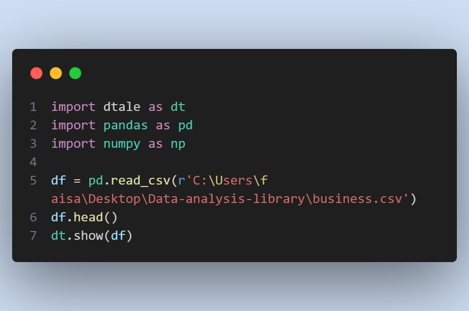
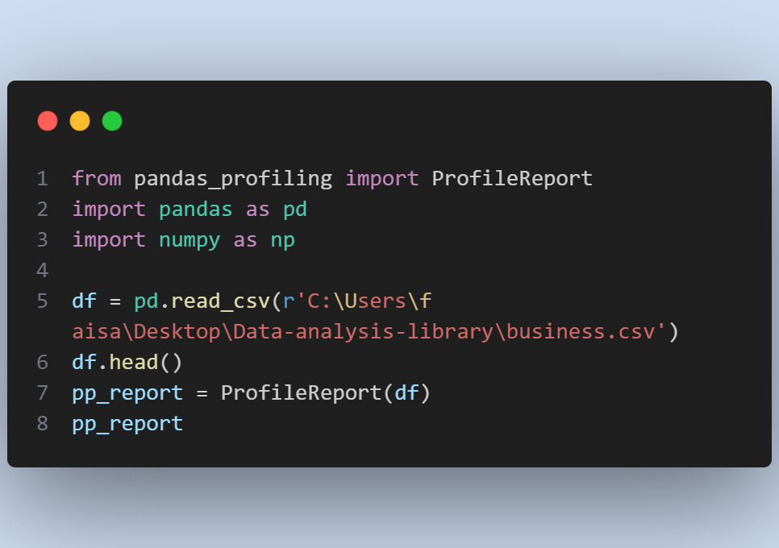
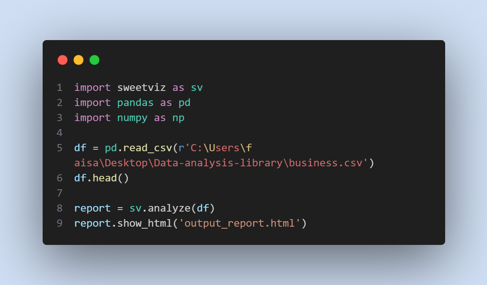

#  <h1 align="center">python library for Data representing </h1>

In this repo. I'm showing some library that are represinting the data in GUI window or in a web page for analyzing and checking the Data, 
the [data](business.csv) I used here is just for testing but you can use it as you like 😉.


##     <h1 align='center'>  Dtale  </h1> 

 - how to install the first library 🥇

```
%pip install dtale

```

```

!pip install dtale

```


 - How to use it ? 
      
    - Code : 


  
  - How it works : 


##       <h1 align='center'> pandas profiling  </h1>

- how to install the second library 🥈

```
%pip install pandas_profiling

```

```

!pip install pandas_profiling 

```


- How to use it ?

  - code : 


  
  - How it's Works:


##   <h1 align='center'> SweetViz </h1>

  - how to install the third library 🥉


```
%pip install sweetviz

``` 

```
!pip install sweetviz

```

 - How to use it ?

  - code: 



  - How it works :


#  <h1 align="center">Thanks :blush: </h1>
