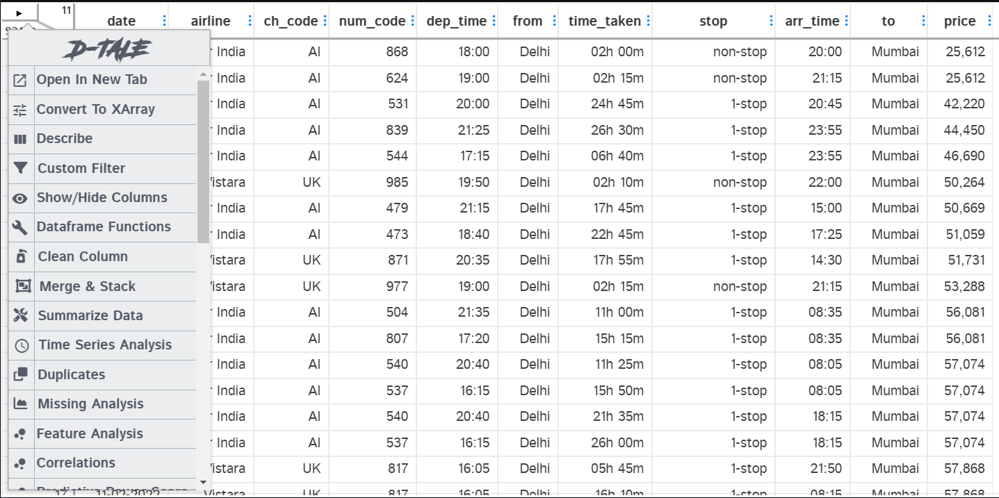
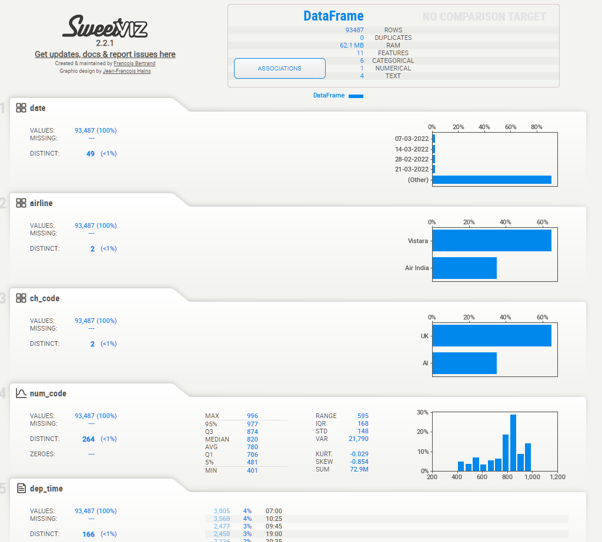

#  <h1 align="center">python library for Data representing </h1>

In this repo. I'm showing some library that are represinting the data in GUI window or in a web page for analyzing and checking the Data, 
the [data](business.csv) I used here is just for testing but you can use it as you like 😉.


### Dtale 

 - how to install the first library 🥇

```
%pip install dtale

```

```

!pip install dtale

```

- How to use it ? 




### pandas profiling 

- how to install the second library 🥈

```
%pip install pandas_profiling

```

```

!pip install pandas_profiling 

```


- How to use it ?


### SweetViz

  - how to install the third library 🥉


```
%pip install sweetviz

``` 

```
!pip install sweetviz

```

 - How to use it ?




